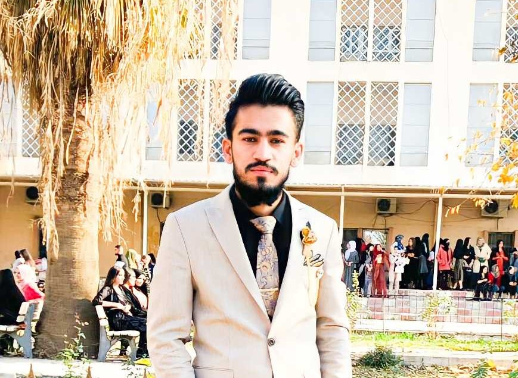

<!DOCTYPE html>
<html dir="eng">
<head>
  <meta charset="UTF-8">
  <meta name="viewport" content="width=device-width, initial-scale=1.0">
  <title>my profile</title> 
  <link rel="stylesheet" href="https://cdnjs.cloudflare.com/ajax/libs/font-awesome/5.14.0/css/all.min.css"/>
  <link rel="stylesheet" href="style.css">
  <link rel="preconnect" href="https://fonts.gstatic.com" crossorigin>
  <link href="https://fonts.googleapis.com/css2?family=Kaushan+Script&display=swap" rel="stylesheet"
</head>
<body>
  

    

      

        
      

      
Mohammad Basher Alsurchy

      
Agricultural engineer

       
      
       
 I'm studying at Salahaddin University College of Agricultural Engineering, I wish to be a skilled engineer to serve  my people  I proudly chose  that job . 

      
      

        
        
        

      

      <a href="https://instagram.com/darbaz_rasul_721?utm_medium=copy_link" class="contact-btn">Developer Darbaz Rasull</a>
    

    

      

        

          213
          Posts
        

        

        

          127
          Following
        

        

        

          100K
          Followers
        

      

    

  

</body>
</html>
